# 💋 sexy.pivoine.art

<div align="center">


*"Lust und Liebe gehören zusammen - wer das eine verteufelt, zerstört auch das andere."*
— **Beate Uhse**, Pionierin der sexuellen Befreiung ✈️

---

### 🍆 An Intimate Platform for Liberation & Pleasure 🍆

Built with passion, technology, and the fearless spirit of sexual empowerment

[](https://github.com/valknarxxx/sexy.pivoine.art/actions/workflows/docker-build-push.yml)
[](https://github.com/valknarxxx/sexy.pivoine.art/actions/workflows/docker-scan.yml)
[](LICENSE)
[](http://sexy.pivoine.art)

</div>

---

## 👅 What Is This Delicious Creation?

Welcome, dear pleasure-seeker! This is **sexy.pivoine.art** — a modern, sensual platform combining the elegance of **SvelteKit**, the power of **Directus CMS**, and the intimate connection of **Buttplug.io** hardware integration.

Like Beate Uhse breaking barriers in post-war Germany, we believe in the freedom to explore, create, and celebrate sexuality without shame. This platform is built for **models**, **creators**, and **connoisseurs** of adult content who deserve technology as sophisticated as their desires.

### ♉ Features That'll Make You Blush ♊

- 💖 **Sensual SvelteKit Frontend** with Tailwind CSS 4 styling
- 🗄️ **Headless CMS** powered by Directus for content liberation
- 🎮 **Hardware Integration** via Buttplug.io (yes, really!)
- 🌐 **Multi-Platform Support** (AMD64 + ARM64) — pleasure everywhere
- 🔒 **Session-Based Authentication** — discretion guaranteed
- 📱 **Responsive Design** that looks sexy on any device
- 🌍 **Internationalization** — pleasure speaks all languages
- 📊 **Analytics Integration** (Umami) — know your admirers
- 📧 **Newsletter Integration** (Letterspace) — stay connected

<div align="center">

### 🍑 Technology Stack 🍑

</div>

```
┌─────────────────────────────────────────────────────────────┐
│  💋 Frontend Layer                                          │
│  ├─ SvelteKit 2.0         → Smooth as silk               │
│  ├─ Tailwind CSS 4        → Styled to seduce             │
│  ├─ bits-ui Components    → Building blocks of pleasure   │
│  └─ Vite                  → Fast and furious             │
├─────────────────────────────────────────────────────────────┤
│  🍷 Backend Layer                                           │
│  ├─ Directus CMS          → Content with no limits       │
│  ├─ Custom Extensions     → Bespoke pleasures            │
│  └─ PostgreSQL            → Data deep and secure         │
├─────────────────────────────────────────────────────────────┤
│  🎀 Hardware Layer                                          │
│  ├─ Buttplug.io           → Real connections             │
│  ├─ TypeScript + Rust     → Power and precision          │
│  └─ WebBluetooth API      → Wireless intimacy            │
├─────────────────────────────────────────────────────────────┤
│  🌸 DevOps Layer                                            │
│  ├─ Docker                → Containerized ecstasy         │
│  ├─ GitHub Actions        → Automated seduction          │
│  └─ GHCR                  → Images served hot            │
└─────────────────────────────────────────────────────────────┘
```

---

## 🔥 Quick Start — Get Intimate Fast

### 💕 Option 1: Using Docker (Recommended)

```bash
# Pull the pleasure
docker pull ghcr.io/valknarxxx/sexy:latest

# Run with passion
docker run -d -p 3000:3000 \
  -e PUBLIC_API_URL=https://api.your-domain.com \
  -e PUBLIC_URL=https://your-domain.com \
  ghcr.io/valknarxxx/sexy:latest

# Visit your creation at http://localhost:3000 💋
```

See [QUICKSTART.md](QUICKSTART.md) for the full seduction guide.

### 💜 Option 2: Local Development

**Prerequisites:**

1. Node.js 20.19.1 — *the foundation*
2. `corepack enable` — *unlock the tools*
3. `pnpm install` — *gather your ingredients*
4. Rust + `cargo install wasm-bindgen-cli` — *forge the connection*

**Start your pleasure journey:**

```bash
# Awaken all services
pnpm dev

# Or tease them one by one
pnpm dev:data      # The foundation
pnpm dev:directus  # The content
pnpm --filter @sexy.pivoine.art/frontend dev  # The face
```

Visit `http://localhost:3000` and let the experience begin... 💋

---

## 🌹 Project Structure

This monorepo contains three packages, each serving its purpose:

```
sexy.pivoine.art/
├─ 💄 packages/frontend/    → SvelteKit app (the seduction)
├─ 🎭 packages/bundle/       → Directus extensions (the power)
└─ 🎮 packages/buttplug/     → Hardware control (the connection)
```

---

## 📚 Documentation — Your Guide to Pleasure

<div align="center">

| Document | Purpose | Emoji |
|----------|---------|-------|
| [QUICKSTART.md](QUICKSTART.md) | Get wet... I mean, get started! | 💦 |
| [DOCKER.md](DOCKER.md) | Complete deployment manual | 🐳 |
| [CLAUDE.md](CLAUDE.md) | Architecture & development | 🤖 |
| [.github/workflows/README.md](.github/workflows/README.md) | CI/CD workflows | ⚙️ |

</div>

---

## 🎨 Building — Craft Your Masterpiece

### Build All Packages

```bash
# Prepare everything
pnpm install

# Build the WASM foundation
pnpm --filter @sexy.pivoine.art/buttplug build:wasm

# Build the packages
pnpm --filter @sexy.pivoine.art/buttplug build
pnpm --filter @sexy.pivoine.art/frontend build
pnpm --filter @sexy.pivoine.art/bundle build
```

### Build Docker Image

```bash
# Quick build
./build.sh

# Manual control
docker build -t sexy.pivoine.art:latest .

# Multi-platform pleasure
docker buildx build --platform linux/amd64,linux/arm64 -t sexy.pivoine.art:latest .
```

---

## 🚀 Deployment — Share Your Creation

### Production with Docker

```bash
# Configure your secrets
cp .env.production.example .env.production
# Edit .env.production with your intimate details

# Deploy with grace
docker-compose -f docker-compose.production.yml up -d
```

### Production without Docker

```bash
# Build everything
pnpm build:frontend

# Start serving
pnpm --filter @sexy.pivoine.art/frontend start
```

---

## 🌈 Environment Variables

### 💖 Required (The Essentials)

- `PUBLIC_API_URL` — Your Directus backend
- `PUBLIC_URL` — Your frontend domain

### 💜 Optional (The Extras)

- `PUBLIC_UMAMI_ID` — Analytics tracking
- `LETTERSPACE_API_URL` — Newsletter endpoint
- `LETTERSPACE_API_KEY` — Newsletter key
- `LETTERSPACE_LIST_ID` — Mailing list

See [.env.production.example](.env.production.example) for the full configuration.

---

## 🎭 Development Workflow

```mermaid
graph LR
    A[💡 Idea] --> B[💻 Code]
    B --> C[🧪 Test Locally]
    C --> D[🌿 Feature Branch]
    D --> E[📤 Push & PR]
    E --> F{✅ CI Pass?}
    F -->|Yes| G[🔀 Merge to Main]
    F -->|No| B
    G --> H[🚀 Auto Deploy]
    H --> I[🏷️ Tag Release]
    I --> J[🎉 Celebrate]
```



1. Create → `git checkout -b feature/my-sexy-feature`
2. Develop → Write beautiful code
3. Test → `pnpm dev`
4. Push → Create PR (triggers CI build)
5. Merge → Automatic deployment to production
6. Release → `git tag v1.0.0 && git push origin v1.0.0`

---

## 🔐 Security — Protected Pleasure

- 🛡️ Daily vulnerability scans with Trivy
- 🔒 Non-root Docker containers
- 📊 Security reports in GitHub Security tab
- 🤐 Confidential issue reporting available

*Report security concerns privately via GitHub Security.*

---

## 💝 Contributing — Join the Movement

Like Beate Uhse fought for sexual liberation, we welcome contributors who believe in freedom, pleasure, and quality code.

1. **Fork** this repository
2. **Create** your feature branch
3. **Commit** your changes
4. **Push** to your branch
5. **Submit** a pull request

All contributors are bound by our code of conduct: **Respect, Consent, and Quality.**

---

## 🎯 CI/CD Pipeline — Automated Seduction

Our GitHub Actions workflows handle:

- ✅ Multi-platform Docker builds (AMD64 + ARM64)
- ✅ Automated publishing to GHCR
- ✅ Daily security vulnerability scans
- ✅ Weekly cleanup of old images
- ✅ Semantic versioning from git tags

**Images available at:** `ghcr.io/valknarxxx/sexy`

---

## 💌 Credits & Acknowledgments

<div align="center">

### 🌸 Created with Love by 🌸

**[Palina](http://sexy.pivoine.art) & [Valknar](http://sexy.pivoine.art)**

*Für die Mäuse...* 🐭💕

---

### 🙏 Built With

| Technology | Purpose |
|------------|---------|
| [SvelteKit](https://kit.svelte.dev/) | Framework |
| [Directus](https://directus.io/) | CMS |
| [Buttplug.io](https://buttplug.io/) | Hardware |
| [bits-ui](https://www.bits-ui.com/) | Components |

---

### 💐 Inspired by Beate Uhse

Pioneer of sexual liberation (1919-2001)
Pilot, Entrepreneur, Freedom Fighter

*"Eine Frau, die ihre Sexualität selbstbestimmt lebt, ist eine freie Frau."*


</div>

---

## ⚖️ License & Legal

- 📜 See [LICENSE](LICENSE) file for details
- 🔞 **18+ Only** — This platform is for adults
- 🌍 Users must be of legal age in their jurisdiction
- ⚖️ We support equality, freedom, and consensual pleasure

---

## 💬 Support & Community

<div align="center">

[](https://github.com/valknarxxx/sexy.pivoine.art/issues)
[](https://github.com/valknarxxx/sexy.pivoine.art/discussions)
[](http://sexy.pivoine.art)

</div>

---

<div align="center">

### 🍑 Made with 💜 for Freedom, Pleasure & Technology 🍑

```
 ██████╗ ███████╗██╗  ██╗██╗   ██╗
██╔════╝ ██╔════╝╚██╗██╔╝╚██╗ ██╔╝
╚█████╗  █████╗   ╚███╔╝  ╚████╔╝
 ╚═══██╗ ██╔══╝   ██╔██╗   ╚██╔╝
██████╔╝ ███████╗██╔╝╚██╗   ██║
╚═════╝  ╚══════╝╚═╝  ╚═╝   ╚═╝
```

*Pleasure is a human right. Technology is freedom. Together, they are power.*

**[sexy.pivoine.art](http://sexy.pivoine.art)** | © 2025 Palina & Valknar

</div>
